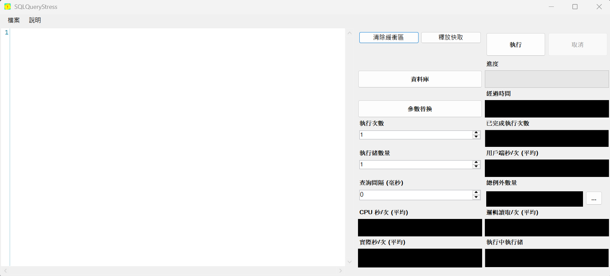

# SqlQueryStress



SQL 查詢壓力測試工具 [由 Adam Machanic 建立](https://dataeducation.com/sqlquerystress-the-source-code/)。

## 安裝

此工具可在任何安裝了 .NET 8.0 執行環境的 Windows 機器上運行。

從 [GitHub 發布版本](https://github.com/ErikEJ/SqlQueryStress/releases) 取得最新版本

[發布說明](https://github.com/ErikEJ/SqlQueryStress/wiki/Release-notes)

## 快速入門指南

[SQL Query Stress 簡介](https://github.com/ErikEJ/SqlQueryStress/wiki)

## 文章

[使用 SqlQueryStress 調整 SQL Server 資料庫、預存程序和索引](https://www.mssqltips.com/sqlservertip/7396/tune-sql-server-databases-stored-procedures-indexes-sqlquerystress/)

## sqlstresscmd

也提供使用相同載入引擎的跨平台命令列工具，[請參閱專屬說明](https://github.com/ErikEJ/SqlQueryStress/blob/master/src/SqlQueryStressCLI/README.md)

## 連線設定

SQL Query Stress 會自動套用類似 SQL Server Management Studio (SSMS) 的 SQL Server 連線設定，以確保一致的查詢執行行為。這些設定是從應用程式目錄中的 `querysettings.sql` 檔案讀取的。

### 預設設定

預設情況下，每個連線都會套用以下相容 SSMS 的設定：

- `SET QUOTED_IDENTIFIER ON;`
- `SET ANSI_NULL_DFLT_ON ON;`
- `SET ANSI_PADDING ON;`
- `SET ANSI_WARNINGS ON;`
- `SET ANSI_NULLS ON;`
- `SET ARITHABORT ON;`
- `SET CONCAT_NULL_YIELDS_NULL ON;`

這些設定符合預設的 SSMS 配置，確保 SSMS 和 SQL Query Stress 之間的查詢執行行為一致。

### 自訂連線設定

您可以透過編輯應用程式目錄中的 `querysettings.sql` 檔案來自訂連線設定。可以在此檔案中添加任何有效的 T-SQL `SET` 命令，它們會在每個連線開啟時自動執行。

自訂範例：

```sql
SET NOCOUNT ON;
SET STATISTICS IO ON;
SET STATISTICS TIME ON;
```

**注意：** 設定會在連線開啟時自動套用，因此不需要修改您的測試查詢。

## 貢獻

歡迎任何形式的貢獻！請查看完整的[貢獻指南](CONTRIBUTING.md)以獲取更多詳細資訊。

## 多語言支援

此工具現已支援繁體中文介面。系統會自動根據您的 Windows 語言設定顯示對應的語言。

- 繁體中文系統：顯示中文介面
- 其他語言系統：顯示英文介面

如果您想添加其他語言的支援，請參考 `src/SQLQueryStress/Properties/` 目錄下的資源檔案。
